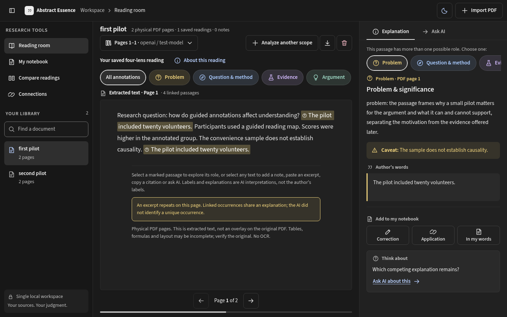

# Abstract Essence

**Learn through critical reading.** A local workspace for papers and theses: import a PDF, approve a bounded AI reading, then explore how the argument works through passages linked to the author's exact words. Published work and AI output are both open to criticism.



## What it does

- **Reads the source, not a summary.** PDF text is extracted in the browser with physical page numbers; the original file is never stored.
- **Maps the argument.** An AI reading highlights passages by role (problem, contribution, approach, evidence, limits) and states explicitly what the selected pages do not establish.
- **Keeps voices separate.** The author's words, the assistant's interpretation, its caveats and your own thinking are always shown apart.
- **Grounds every citation.** The model selects source passages by ID and the server inserts the exact text, so quotations cannot be invented. Answers link each cited passage back to the source.
- **Asks with context.** Question a passage or any selected text; answers are grouped by the passage they were asked about.
- **Builds your notebook.** Source-linked notes, corrections and applications to your own research, plus comparison of saved readings and manually justified document connections.
- **Respects consent and cost.** Nothing reaches a provider without an explicit destination and consent; every request has page, token and rate limits.
- **Accessible by default.** Dark theme with WCAG 2.2 AAA contrast targets, a light theme, keyboard navigation and automated axe checks.

## Quick start

Requirements: Python 3.14, [uv](https://docs.astral.sh/uv/), Node.js 24.15+ (24.x), [pnpm](https://pnpm.io/) and Docker Compose.

```sh
# PostgreSQL and Redis on loopback ports 5547 and 6381
docker compose up -d --wait

cd backend
[ -f .env ] || cp .env.example .env
uv sync --locked
uv run alembic upgrade head
uv run fastapi dev --host 127.0.0.1 --port 8001
```

In another terminal:

```sh
cd frontend
pnpm install --frozen-lockfile
pnpm start
```

Open <http://127.0.0.1:4201> and import a text-based PDF. Reading and notes work without any AI credentials.

## Connect an AI provider

Add a key and the exact model IDs your account can use to `backend/.env`, then restart the API:

```dotenv
ESSENCE_OPENAI_API_KEY=your-private-key
ESSENCE_OPENAI_MODELS=["your-enabled-model-id"]
```

Google (`ESSENCE_GOOGLE_*`) and Anthropic (`ESSENCE_ANTHROPIC_*`) work the same way. There is no default provider, model discovery or silent fallback: you choose the destination and thinking level in the app and consent before anything is sent. Keys stay in the backend.

## Scope and privacy

Abstract Essence is a **single-user, local** application. It has no authentication or multi-tenant isolation; keep the API bound to loopback. Selected page text, the saved interpretation and your question are sent only to the provider you choose, after consent, and provider retention policies apply. There is no OCR: scanned PDFs, formulas and complex layouts may need checking against the original.

## Tests

```sh
cd backend && uv run pytest && uv run ruff check . && uv run ty check
cd frontend && pnpm test && pnpm build && pnpm test:e2e
```

Tests never call real AI providers. Browser tests mock the API and include accessibility checks; set `PLAYWRIGHT_CHROMIUM_EXECUTABLE` to use an installed Chromium.

## Project layout

| Path                   | Contents                                                                                                                       |
| ---------------------- | ------------------------------------------------------------------------------------------------------------------------------ |
| `frontend/`            | Angular 22 app: standalone components, signals, Signal Forms                                                                   |
| `backend/src/essence/` | FastAPI modular monolith: documents, reading (AI workflows), learning                                                          |
| `backend/migrations/`  | Alembic schema migrations                                                                                                      |
| `docs/`                | [Project guide](docs/README.md), [annotated reading design](docs/annotated-reading.md), [reading theme](docs/reading-theme.md) |

The [project guide](docs/README.md) covers configuration, limits, failure handling, architecture and verification in depth.

## License

Copyright (C) 2026 bladhl

This program is free software: you can redistribute it and/or modify it under the terms of the [GNU General Public License](LICENSE) as published by the Free Software Foundation, either version 3 of the License, or (at your option) any later version. It is distributed in the hope that it will be useful, but WITHOUT ANY WARRANTY; without even the implied warranty of MERCHANTABILITY or FITNESS FOR A PARTICULAR PURPOSE.

The bundled Source Sans 3 font is licensed separately under the [SIL Open Font License](frontend/public/fonts/OFL.txt).
